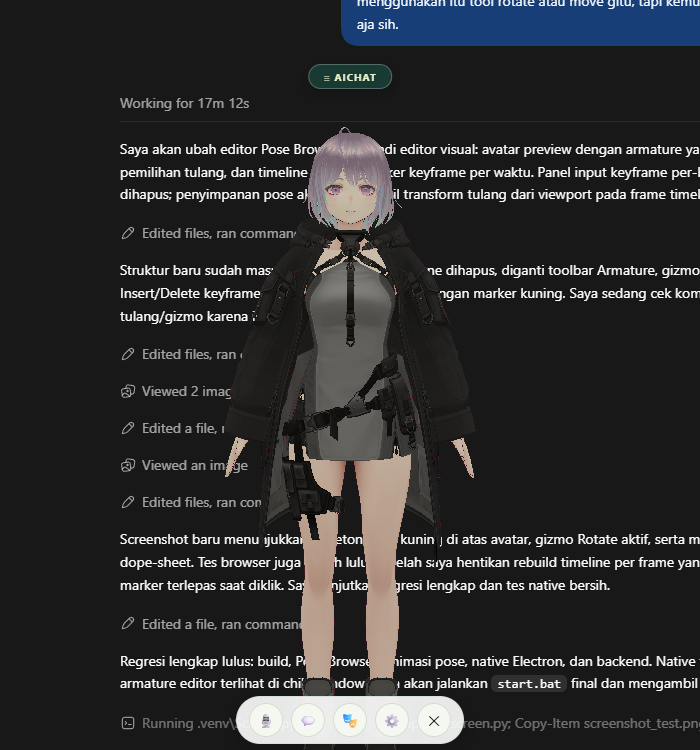
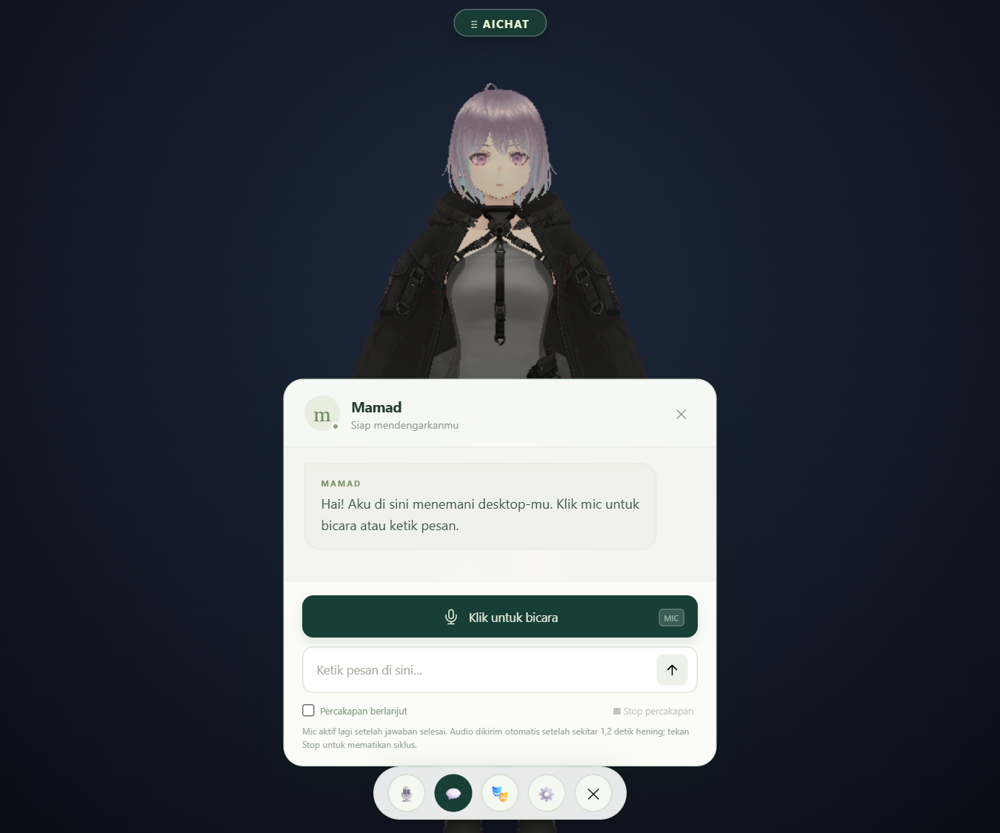
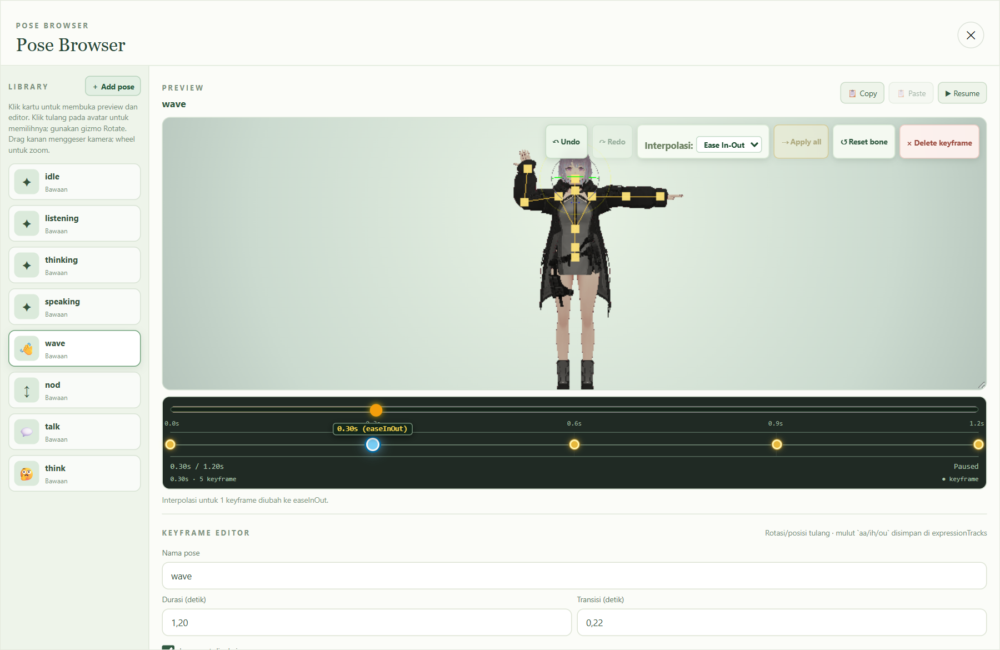
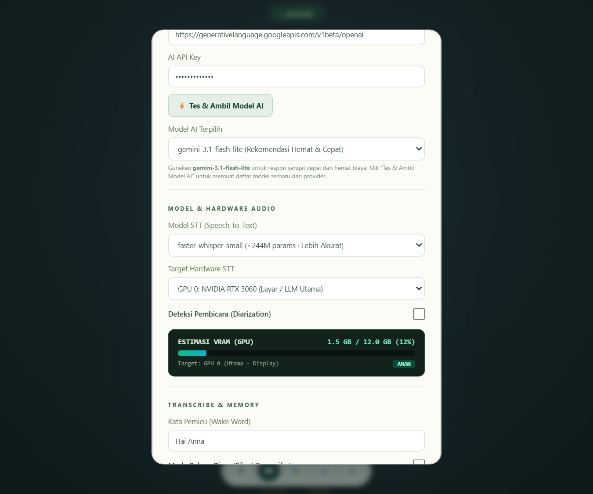

# 3D AI Assistant · VRoid Desktop Companion

<p align="center">
  
</p>

<p align="center">
  <b>Asisten avatar 3D interaktif dan transparan untuk desktop Windows.</b><br>
  Melayang tanpa bingkai (*frameless*) di atas aplikasi aktif Anda. Didukung oleh <b>VRoid Studio (Three.js VRM 1.0)</b>, <b>Faster-Whisper (STT)</b>, <b>Edge-TTS</b>, <b>Gemini / OpenAI API</b>, serta <b>3D Pose Editor</b> dengan kurva interpolasi (*easing*).
</p>

<p align="center">
  
  
  
  
  
</p>

---

## 📸 Tampilan Fitur Utama

### 1. Transparansi Desktop & Interaksi Suara
> Avatar melayang secara transparan di atas layar kerja Anda tanpa mengganggu aktivitas lain, dilengkapi laci percakapan (*conversation drawer*) dan status mikrofon.

<p align="center">
  
</p>

* 🪟 **True Window Transparency**: Melayang di atas software apapun (browser, IDE coding, game, dokumen).
* 🎙️ **Percakapan Berlanjut**: Berbicara secara natural dengan jeda hening otomatis (*Voice Activity Detection*).
* 🛑 **Sela & Bicara**: Potong ucapan asisten kapan saja secara instan.
* 👄 **Lip-Sync Real-time**: Mulut bergerak sinkron mengikuti suara AI melalui ekspresi VRM (`aa`, `ih`, `ou`).

---

### 2. 3D Pose & Keyframe Editor (Blender & Mixamo Style)
> Editor pose 3D visual: pilih tulang humanoid dengan gizmo rotasi, kelola dope-sheet timeline, serta tentukan kurva interpolasi antar keyframe.

<p align="center">
  
</p>

* **Rig Humanoid VRoid Universal**: Langsung kompatibel dengan file `.vrm` apapun dari VRoid Studio tanpa perlu re-rigging.
* **Interpolasi Keyframe (*Easing Curves*)**:
  * `Linear` *(default)* — Transisi konstan antar pose.
  * `Ease In-Out` — Transisi luwes dan natural (akselerasi di awal, deselerasi di akhir).
  * `Ease In` / `Ease Out` — Perlambatan/percepatan halus.
  * `Step` — Menahan pose statis sampai keyframe berikutnya tiba (*hold/snap*).
* **Fitur Timeline Lengkap**: Seleksi kotak *marquee*, multi-select (`Shift + Klik`), Copy-Paste keyframe (`Ctrl+C` / `Ctrl+V`), Undo/Redo bertingkat (`Ctrl+Z` / `Ctrl+Y`), dan ekspor/impor file `.json`.

---

### 3. Panel Pengaturan & Monitor VRAM Real-time
> Pengaturan hardware audio, pilihan model Faster-Whisper (CPU / GPU CUDA), dan pemantau VRAM.

<p align="center">
  
</p>

* **Faster-Whisper STT**: Opsi model `base` (cepat & hemat) atau `small` (akurat) dengan akselerasi NVIDIA CUDA.
* **Estimasi VRAM Real-time**: Indikator VRAM bergaya *in-game monitor* untuk memantau kapasitas memori GPU.
* **Edge-TTS Berkualitas**: Suara natural bahasa Indonesia (`id-ID-GadisNeural`, `id-ID-ArdiNeural`) tanpa biaya langganan API TTS.
* **Kata Pemicu (Wake Word)**: Mode rekam hening di latar belakang yang aktif saat kata pemicu diucapkan.

---

## 🚀 Panduan Memulai Cepat

### 1. Clone & Setup Python
```powershell
git clone https://github.com/mgi24/3D-ai-assitant.git
cd 3D-ai-assitant

python -m venv .venv
.venv\Scripts\pip install -r requirements.txt
```

### 2. Install Dependensi Node & Build
```powershell
npm install
npm run build
```

### 3. Konfigurasi Environment & Avatar
1. Letakkan avatar VRoid Anda di:
   ```
   public/avatar/character.vrm
   ```
2. Salin template `.env.example` ke `.env`:
   ```powershell
   copy .env.example .env
   ```
3. Buka `.env` dan masukkan API Key Anda (Gemini atau OpenAI-compatible):
   ```dotenv
   AI_BASE_URL=https://generativelanguage.googleapis.com/v1beta/openai
   AI_API_KEY=masukkan-api-key-anda
   AI_MODEL=gemini-2.5-flash
   ```

### 4. Jalankan Aplikasi
Cukup klik dua kali **`start.bat`** atau jalankan:
```powershell
.\start.bat
```

---

## ⌨️ Pintasan Keyboard

| Shortcut | Fungsi |
| :--- | :--- |
| `Space` | Pause / Resume playback preview pose |
| `Ctrl + Z` | Undo perubahan pose atau pergeseran keyframe |
| `Ctrl + Y` | Redo perubahan pose |
| `Ctrl + C` | Salin (*Copy*) keyframe terpilih |
| `Ctrl + V` | Tempel (*Paste*) keyframe pada posisi waktu scrubber |
| `Ctrl + A` | Pilih semua keyframe pada timeline |
| `Shift + Klik` | Multi-seleksi marker keyframe |
| `Alt + F4` | Tutup aplikasi & matikan backend bersih |

---

## 📁 Struktur Singkat Proyek

```
├── desktop-main.cjs       # Runner Electron window transparan
├── server.py              # Backend FastAPI (STT, TTS, Chat API)
├── start.bat              # Peluncur Windows satu klik
├── index.html             # UI Desktop & Pose Editor
├── src/
│   ├── avatar.js          # Three.js + VRM 1.0 humanoid loader
│   ├── pose-controller.js # Engine animasi pose & interpolasi easing
│   ├── main.js            # Audio pipeline, state chat & timeline logic
│   └── style.css          # Glassmorphism aesthetic theme
├── public/
│   ├── avatar/            # Letakkan character.vrm di sini
│   └── poses/             # Klip pose bawaan (.json)
├── scripts/               # Automated test Playwright & screenshot capture
└── docs/screenshots/     # Berkas pratinjau antarmuka GitHub
```

---

## 🤝 Kontribusi & Dukungan

Kontribusi, *bug report*, dan *feature request* sangat dipersilakan!
1. Fork repository ini
2. Buat branch fitur baru (`git checkout -b fitur-keren`)
3. Commit perubahan (`git commit -m 'feat: tambah fitur keren'`)
4. Push ke branch (`git push origin fitur-keren`)
5. Ajukan **Pull Request**

⭐ Beri bintang repository ini jika Anda menyukai proyek ini!
