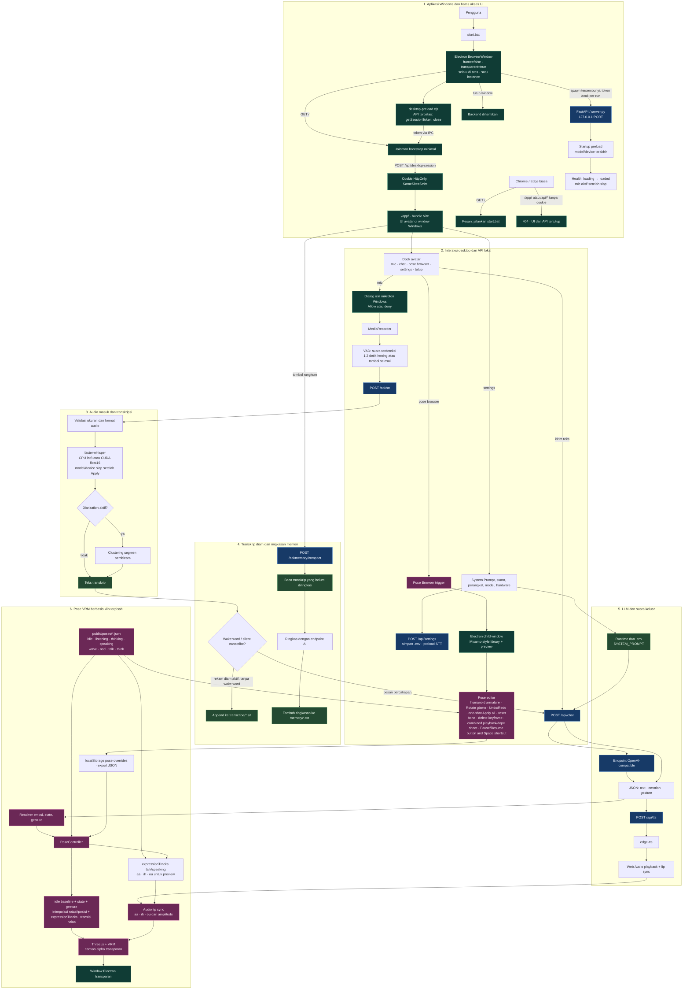

```mermaid
flowchart TD
    subgraph DESKTOP["1. Aplikasi Windows dan batas akses UI"]
        User["Pengguna"] --> Start["start.bat"]
        Start --> Electron["Electron BrowserWindow\nframe=false · transparent=true\nselalu di atas · satu instance"]
        Electron -->|"spawn tersembunyi, token acak per run"| Backend["FastAPI / server.py\n127.0.0.1:PORT"]
        Electron --> Preload["desktop-preload.cjs\nAPI terbatas: getSessionToken, close"]
        Electron -->|"GET /"| Bootstrap["Halaman bootstrap minimal"]
        Preload -->|"token via IPC"| Bootstrap
        Bootstrap -->|"POST /api/desktop-session"| Cookie["Cookie HttpOnly, SameSite=Strict"]
        Cookie --> AppUI["/app/ · bundle Vite\nUI avatar di window Windows"]
        Browser["Chrome / Edge biasa"] -->|"GET /"| Notice["Pesan: jalankan start.bat"]
        Browser -->|"/app/ atau /api/* tanpa cookie"| Denied["404 · UI dan API tertutup"]
        Electron -->|"tutup window"| Stop["Backend dihentikan"]
        Backend --> StartupSTT["Startup preload\nmodel/device terakhir"]
        StartupSTT --> ReadySTT["Health: loading → loaded\nmic aktif setelah siap"]
    end

    subgraph UI["2. Interaksi desktop dan API lokal"]
        AppUI --> Dock["Dock avatar\nmic · chat · pose browser · settings · tutup"]
        Dock -->|"mic"| Permission["Dialog izin mikrofon Windows\nAllow atau deny"]
        Permission --> Recorder["MediaRecorder"]
        Dock -->|"kirim teks"| ChatAPI["POST /api/chat"]
        Recorder --> VAD["VAD: suara terdeteksi\n1,2 detik hening atau tombol selesai"]
        VAD --> STTAPI["POST /api/stt"]
        AppUI -->|"settings"| Settings["System Prompt, suara, perangkat, model, hardware"]
        Settings --> SettingsAPI["POST /api/settings\nsimpan .env · preload STT"]
        Dock -->|"pose browser"| PoseBrowser["Pose Browser trigger"]
        PoseBrowser --> PoseWindow["Electron child window\nMixamo-style library + preview"]
        PoseWindow --> PoseManager["Pose editor\nhumanoid armature · Rotate gizmo · Undo/Redo · one-shot Apply all · reset bone · delete keyframe · combined playback/dope sheet · Pause/Resume button and Space shortcut"]
    end

    subgraph AUDIO["3. Audio masuk dan transkripsi"]
        STTAPI --> Validate["Validasi ukuran dan format audio"]
        Validate --> Whisper["faster-whisper\nCPU int8 atau CUDA float16\nmodel/device siap setelah Apply"]
        Whisper --> Diarization{"Diarization aktif?"}
        Diarization -->|"ya"| Labels["Clustering segmen pembicara"]
        Diarization -->|"tidak"| Transcript["Teks transkrip"]
        Labels --> Transcript
    end

    subgraph MEMORY["4. Transkrip diam dan ringkasan memori"]
        Transcript --> Route{"Wake word / silent transcribe?"}
        Route -->|"rekam diam aktif, tanpa wake word"| SRT["Append ke transcribe/*.srt"]
        Route -->|"pesan percakapan"| ChatAPI
        Compact["POST /api/memory/compact"] --> ReadSRT["Baca transkrip yang belum diringkas"]
        ReadSRT --> Summarize["Ringkas dengan endpoint AI"]
        Summarize --> MemoryFile["Tambah ringkasan ke memory/*.txt"]
    end

    subgraph AI["5. LLM dan suara keluar"]
        Settings --> Env["Runtime dan .env\nSYSTEM_PROMPT"]
        Env --> ChatAPI
        ChatAPI --> LLM["Endpoint OpenAI-compatible"]
        LLM --> Reply["JSON: text · emotion · gesture"]
        Reply --> TTSAPI["POST /api/tts"]
        TTSAPI --> TTS["edge-tts"]
        TTS --> Playback["Web Audio playback + lip sync"]
    end

    subgraph POSES["6. Pose VRM berbasis klip terpisah"]
        Reply --> Resolver["Resolver emosi, state, gesture"]
        Resolver --> Controller["PoseController"]
        PoseFiles["public/poses/*.json\nidle · listening · thinking · speaking\nwave · nod · talk · think"] --> Controller
        PoseFiles --> PoseManager
        PoseManager --> PoseOverrides["localStorage pose overrides\n· export JSON"]
        PoseOverrides --> Controller
        Controller --> Blend["idle baseline + state + gesture\ninterpolasi rotasi/posisi + expressionTracks · transisi halus"]
        Blend --> Renderer["Three.js + VRM\ncanvas alpha transparan"]
        Renderer --> NativeWindow["Window Electron transparan"]
        PoseFiles --> PoseExpressions["expressionTracks talk/speaking\naa · ih · ou untuk preview"]
        Controller --> PoseExpressions
        Playback --> LipSync["Audio lip sync\naa · ih · ou dari amplitudo"]
        PoseExpressions --> LipSync
        LipSync --> Renderer
    end

    ChatAPI --> Reply
    AppUI -->|"tombol rangkum"| Compact

    classDef native fill:#103c35,stroke:#4c9b83,color:#eefbf5;
    classDef api fill:#173a67,stroke:#5592dd,color:#eef5ff;
    classDef pose fill:#6b2856,stroke:#d47bb4,color:#fff0fa;
    classDef data fill:#244a32,stroke:#6eae79,color:#f2fff3;
    class Electron,Preload,Bootstrap,Cookie,AppUI,Notice,Denied,Stop,Permission,NativeWindow,PoseWindow native;
    class Backend,ChatAPI,STTAPI,SettingsAPI,Compact,TTSAPI,LLM api;
    class PoseFiles,PoseBrowser,PoseManager,Controller,Blend,Renderer,Resolver,LipSync pose;
    class SRT,MemoryFile,Transcript,ReadSRT,Env data;
```
